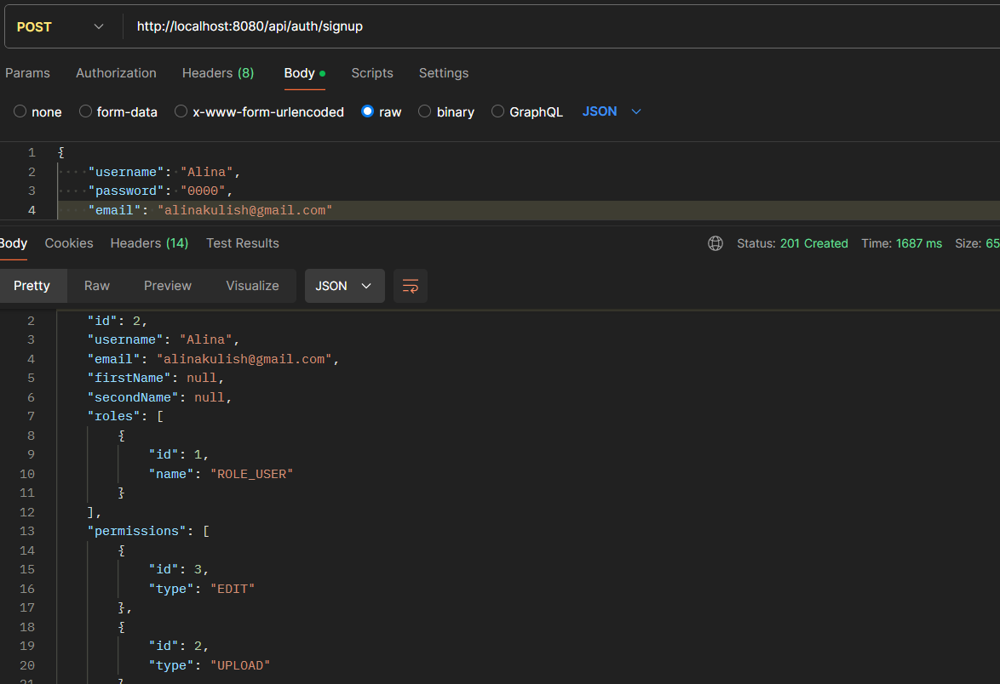
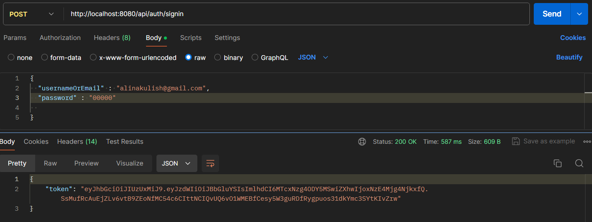
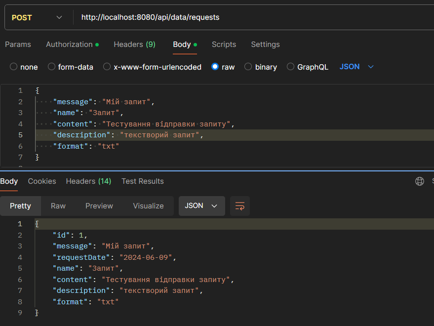
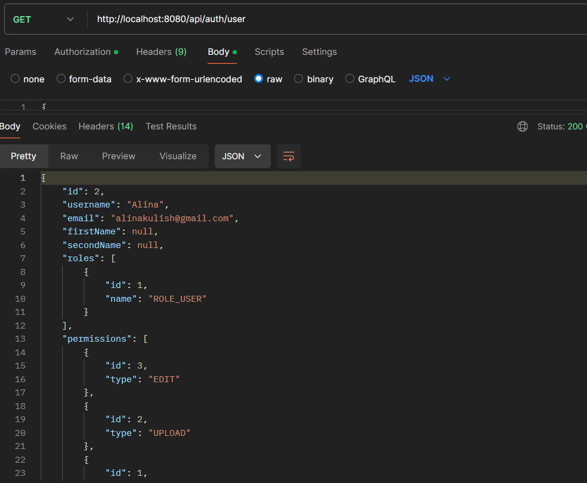
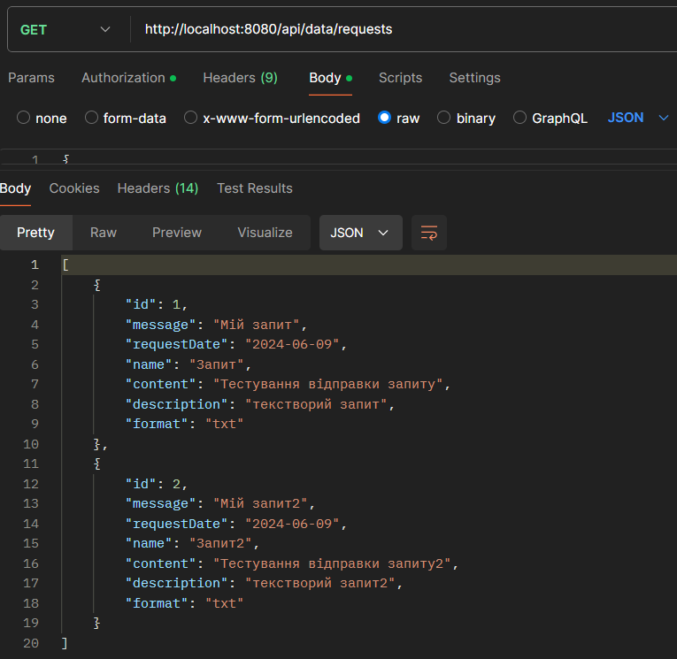
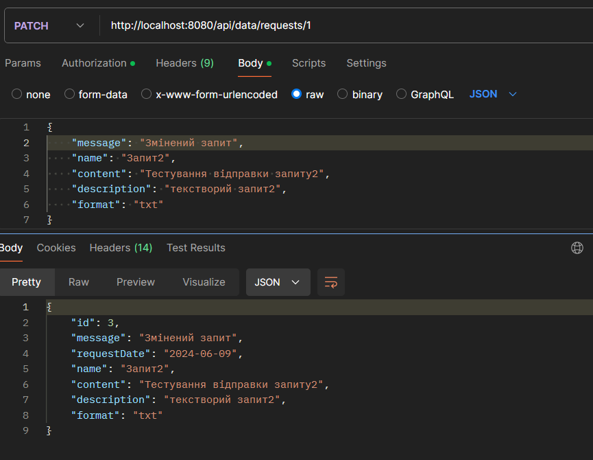

# Тестування працездатності системи

*В цьому розділі необхідно вказати засоби тестування, навести вихідні коди тестів та результати тестування.*
*Тестування виконується за допомогою Postman*
*Для авторизації використовуються JWT токени. У кожному запиті Користувача або Адміністратора в Headers додається Authorization з токеном*

## POST

### Зареєструватись - Гість

### Авторизуватись - Гість

### Відправка запиту - Гість

## GET

### Отримати дані про користувача - Коритсувач

### Отримати всі запити користувача - Користувач

## PATCH

### Змінити запит - Користувач

